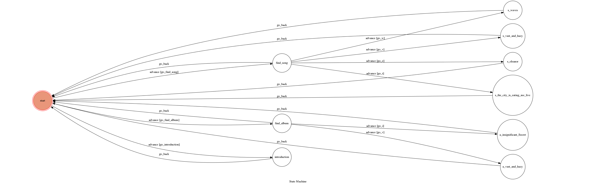

# TOC Project 2017
##介紹樂團 vast & hazy

## Finite State Machine

## Usage
The initial state is set to `start`.

* start
	* Input: "go to state1"
		* Reply: "I'm entering state1"

	* Input: "go to state2"
		* Reply: "I'm entering state2"

